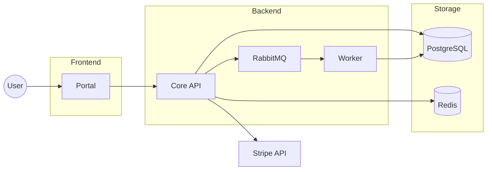
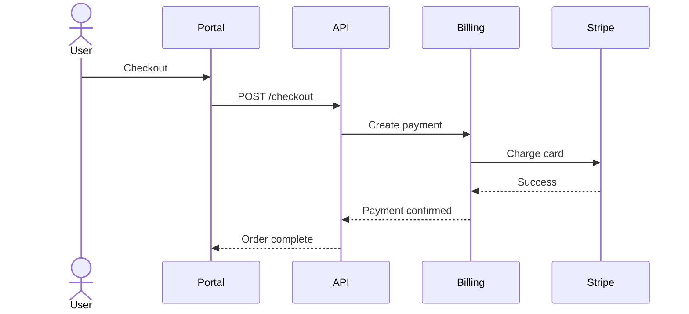
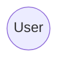
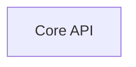
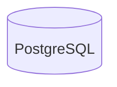
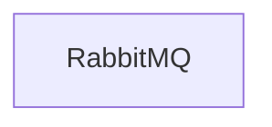

# Mermaid Skill

## When to Use This Skill

Use this skill when a user asks to create, update, validate, or troubleshoot Mermaid diagrams for architecture, request flows, sequence flows, async processing, or Markdown documentation rendering compatibility.

## Purpose

This guide defines how to create stable, readable, production-safe Mermaid diagrams that work well with:

- GitHub Copilot
- Cursor
- Claude
- VSCode
- GitHub Markdown
- Mermaid CLI
- CI/CD validation

The goal is to make diagrams:

- easy for humans to understand
- easy for AI agents to reason about
- stable across renderers
- Git-friendly
- maintainable over time

---

# Core Principles

## 1. One Diagram = One Responsibility

Bad:
- architecture + deployment + request flow in one diagram

Good:
- one system overview
- one request flow
- one auth flow
- one async processing flow

If a diagram answers more than one major question, split it.

---

## 2. Prefer Simple Layouts

Always prefer:

- `flowchart TD`
- `flowchart LR`
- `sequenceDiagram`

Avoid:

- deep nesting
- giant graphs
- dense cross-links
- complex bidirectional arrows

The simpler the graph, the better AI can reason about it.

---

## 3. Stable Syntax Only

Use only production-safe Mermaid features.

Allowed:


Forbidden:

- architecture-beta
- block-beta
- xychart-beta
- init/theme blocks
- custom styling
- classDef
- icons/emojis
- external assets

---

# Recommended Diagram Types

## 1. System Overview Diagram

Purpose:
- understand the whole system
- show services and dependencies
- show databases and external APIs

Best starter:

```mermaid
flowchart LR
```

Example:



---

## 2. Request Flow Diagram

Purpose:
- understand runtime behavior
- explain how requests move through the system

Best starter:

```mermaid
sequenceDiagram
```

Example:



---

# Layout Rules

## Use LR for Architecture

Use:

```mermaid
flowchart LR
```

for:
- services
- infrastructure
- dependencies
- external systems

---

## Use TD for Processes

Use:

```mermaid
flowchart TD
```

for:
- workflows
- pipelines
- state transitions

---

## Use Sequence Diagrams for Requests

Use:

```mermaid
sequenceDiagram
```

for:
- HTTP calls
- async flows
- event processing
- auth

---

# Node Conventions

## User



## Service



## Database



## Queue



---

# Arrow Rules

Prefer:

```mermaid
A --> B
```

Avoid:
- excessive dashed arrows
- bidirectional arrows
- decorative arrows

---

# AI-Friendly Design

Prefer:
- linear flows
- logical grouping
- few crossing arrows
- small focused diagrams

Avoid:
- giant everything diagrams
- mixed concerns
- visual complexity

---

# Recommended Repository Structure

```text
/docs/architecture
    system-overview.md
    deployment-overview.md

/docs/flows
    login-flow.md
    checkout-flow.md
    async-processing.md
```

---

# VSCode Workflow

Recommended extensions:

- Markdown Preview Mermaid Support
- Mermaid Markdown Syntax Highlighting

Preview:
- Ctrl + Shift + V

Prefer `.md` files over `.mmd`.

---

# CI/CD Validation

Install Mermaid CLI:

```bash
npm install -g @mermaid-js/mermaid-cli
```

Render:

```bash
mmdc -i diagram.md -o diagram.svg
```

Recommended CI rule:
- fail PR if Mermaid cannot render

---

# Golden Rules

Always prefer:

- stable syntax
- simple structure
- Git compatibility
- AI readability
- renderer compatibility

Over:

- visual complexity
- experimental syntax
- excessive detail
