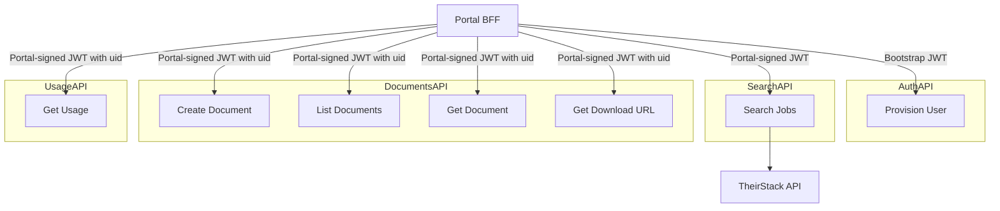

```mermaid
flowchart TD

    Client[Portal BFF]

    subgraph AuthAPI
        Provision[Provision User]
    end

    subgraph SearchAPI
        SearchJobs[Search Jobs]
    end

    subgraph DocumentsAPI
        CreateDoc[Create Document]
        ListDocs[List Documents]
        GetDoc[Get Document]
        DownloadUrl[Get Download URL]
    end

    subgraph UsageAPI
        Usage[Get Usage]
    end

    Search[TheirStack API]

    Client -->|Bootstrap JWT| Provision
    Client -->|Portal-signed JWT| SearchJobs
    Client -->|Portal-signed JWT with uid| CreateDoc
    Client -->|Portal-signed JWT with uid| ListDocs
    Client -->|Portal-signed JWT with uid| GetDoc
    Client -->|Portal-signed JWT with uid| DownloadUrl
    Client -->|Portal-signed JWT with uid| Usage

    SearchJobs --> Search
```
