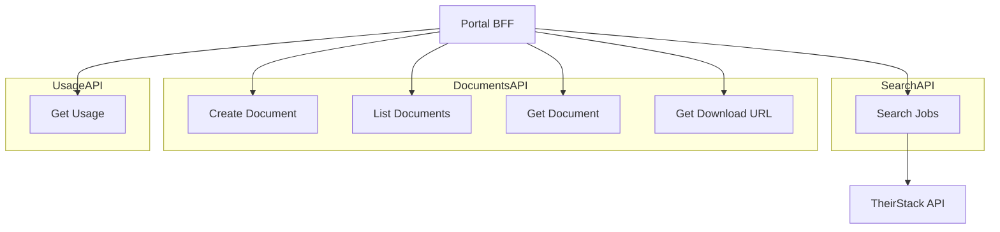

```mermaid
flowchart TD

    Client[Portal BFF]

    subgraph SearchAPI
        SearchJobs[Search Jobs]
    end

    subgraph DocumentsAPI
        CreateDoc[Create Document]
        ListDocs[List Documents]
        GetDoc[Get Document]
        DownloadUrl[Get Download URL]
    end

    subgraph UsageAPI
        Usage[Get Usage]
    end

    Search[TheirStack API]

    Client --> SearchJobs
    Client --> CreateDoc
    Client --> ListDocs
    Client --> GetDoc
    Client --> DownloadUrl
    Client --> Usage

    SearchJobs --> Search
```
