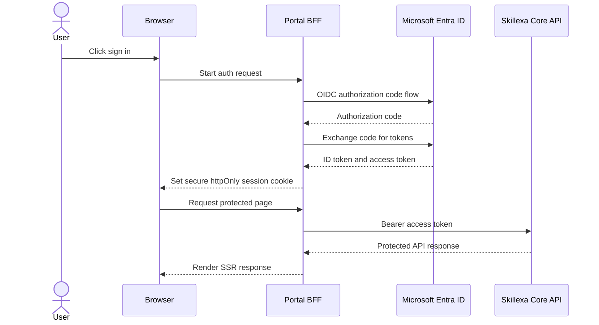

```mermaid
sequenceDiagram

    actor User
    participant Browser
    participant Portal as Portal BFF
    participant Entra as Microsoft Entra ID
    participant Core as Skillexa Core API

    User->>Browser: Click sign in
    Browser->>Portal: Start auth request
    Portal->>Entra: OIDC authorization code flow
    Entra-->>Portal: Authorization code
    Portal->>Entra: Exchange code for tokens
    Entra-->>Portal: ID token and access token
    Portal-->>Browser: Set secure httpOnly session cookie
    Browser->>Portal: Request protected page
    Portal->>Core: Bearer access token
    Core-->>Portal: Protected API response
    Portal-->>Browser: Render SSR response
```
