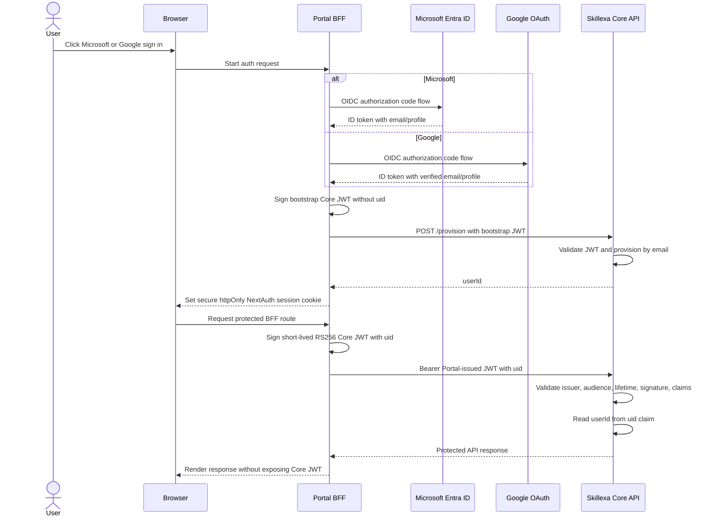

```mermaid
sequenceDiagram

    actor User
    participant Browser
    participant Portal as Portal BFF
    participant Microsoft as Microsoft Entra ID
    participant Google as Google OAuth
    participant Core as Skillexa Core API

    User->>Browser: Click Microsoft or Google sign in
    Browser->>Portal: Start auth request
    alt Microsoft
        Portal->>Microsoft: OIDC authorization code flow
        Microsoft-->>Portal: ID token with email/profile
    else Google
        Portal->>Google: OIDC authorization code flow
        Google-->>Portal: ID token with verified email/profile
    end
    Portal->>Portal: Sign bootstrap Core JWT without uid
    Portal->>Core: POST /provision with bootstrap JWT
    Core->>Core: Validate JWT and provision by email
    Core-->>Portal: userId
    Portal-->>Browser: Set secure httpOnly NextAuth session cookie
    Browser->>Portal: Request protected BFF route
    Portal->>Portal: Sign short-lived RS256 Core JWT with uid
    Portal->>Core: Bearer Portal-issued JWT with uid
    Core->>Core: Validate issuer, audience, lifetime, signature, claims
    Core->>Core: Read userId from uid claim
    Core-->>Portal: Protected API response
    Portal-->>Browser: Render response without exposing Core JWT
```
