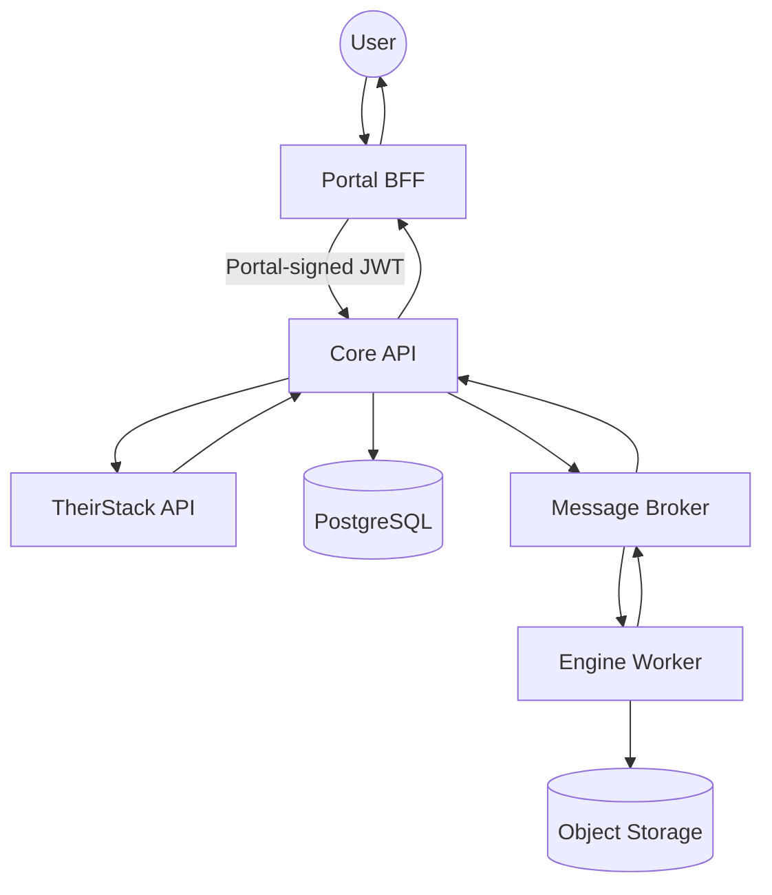

```mermaid
flowchart TD

    User((User))

    Portal[Portal BFF]

    Core[Core API]

    Search[TheirStack API]

    Db[(PostgreSQL)]

    Broker[Message Broker]

    Engine[Engine Worker]

    Blob[(Object Storage)]

    User --> Portal

    Portal -->|Portal-signed JWT| Core

    Core --> Search

    Search --> Core

    Core --> Db

    Core --> Broker

    Broker --> Engine

    Engine --> Blob

    Engine --> Broker

    Broker --> Core

    Core --> Portal

    Portal --> User
```
