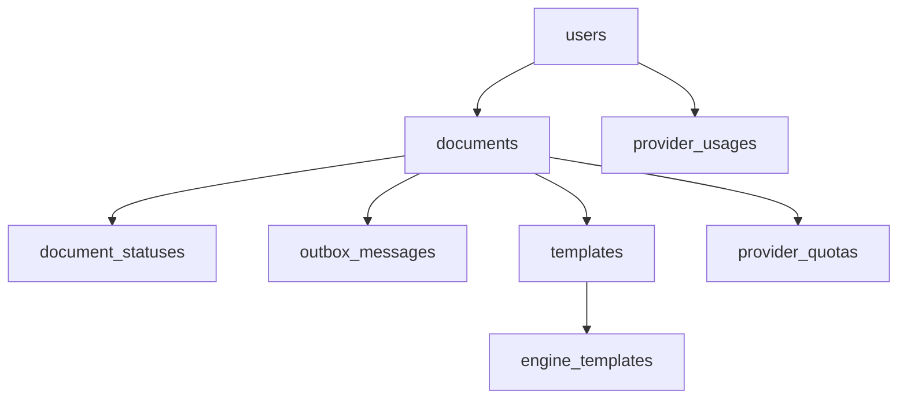

```mermaid
flowchart TD

    Users[users]

    Documents[documents]

    Statuses[document_statuses]

    ProviderUsage[provider_usages]

    Outbox[outbox_messages]

    Templates[templates]

    EngineTemplates[engine_templates]

    Quotas[provider_quotas]

    Users --> Documents

    Documents --> Statuses

    Users --> ProviderUsage

    Documents --> Outbox

    Documents --> Templates

    Templates --> EngineTemplates

    Documents --> Quotas
```
