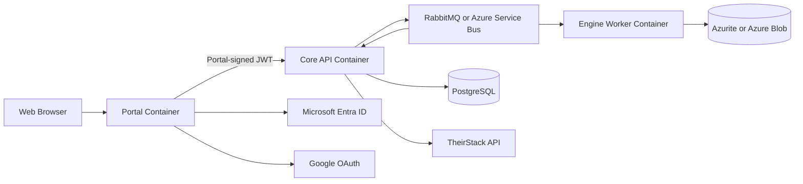

```mermaid
flowchart LR

    Browser[Web Browser]
    Portal[Portal Container]
    Core[Core API Container]
    Engine[Engine Worker Container]
    Broker[RabbitMQ or Azure Service Bus]
    Db[(PostgreSQL)]
    Blob[(Azurite or Azure Blob)]
    Microsoft[Microsoft Entra ID]
    Google[Google OAuth]
    Search[TheirStack API]

    Browser --> Portal
    Portal --> Microsoft
    Portal --> Google
    Portal -->|Portal-signed JWT| Core
    Core --> Search
    Core --> Db
    Core --> Broker
    Broker --> Engine
    Engine --> Blob
    Broker --> Core
```
