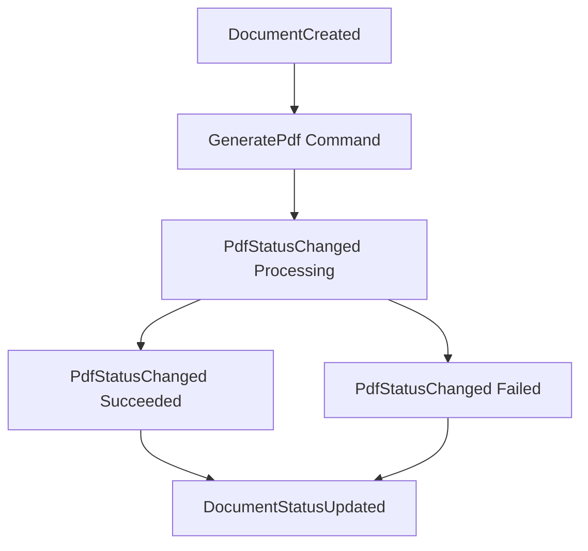

```mermaid
flowchart TD

    Created[DocumentCreated]
    Generate[GeneratePdf Command]
    Processing[PdfStatusChanged Processing]
    Succeeded[PdfStatusChanged Succeeded]
    Failed[PdfStatusChanged Failed]
    Updated[DocumentStatusUpdated]

    Created --> Generate
    Generate --> Processing
    Processing --> Succeeded
    Processing --> Failed
    Succeeded --> Updated
    Failed --> Updated
```
