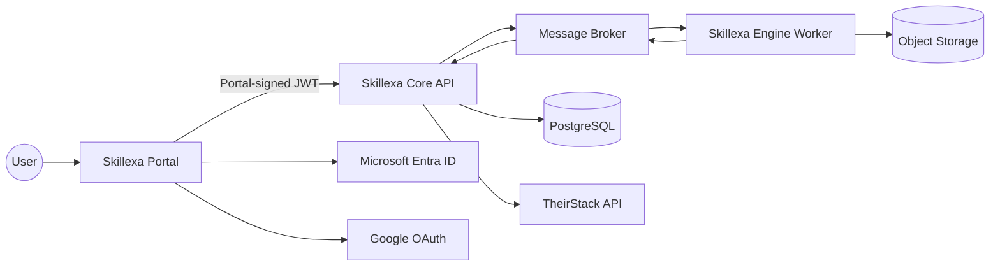

```mermaid
flowchart LR

    User((User))
    Portal[Skillexa Portal]
    Core[Skillexa Core API]
    Engine[Skillexa Engine Worker]
    Broker[Message Broker]
    Db[(PostgreSQL)]
    Blob[(Object Storage)]
    Search[TheirStack API]
    Microsoft[Microsoft Entra ID]
    Google[Google OAuth]

    User --> Portal
    Portal --> Microsoft
    Portal --> Google
    Portal -->|Portal-signed JWT| Core
    Core --> Search
    Core --> Db
    Core --> Broker
    Broker --> Engine
    Engine --> Blob
    Engine --> Broker
    Broker --> Core
```
