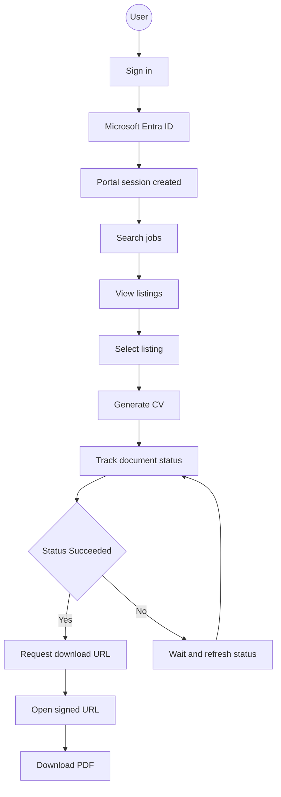

```mermaid
flowchart TD

    User((User)) --> SignIn[Sign in]
    SignIn --> Entra[Microsoft Entra ID]
    Entra --> Session[Portal session created]
    Session --> Search[Search jobs]
    Search --> Results[View listings]
    Results --> Choose[Select listing]
    Choose --> Generate[Generate CV]
    Generate --> Track[Track document status]
    Track --> Ready{Status Succeeded}
    Ready -->|Yes| Download[Request download URL]
    Download --> Open[Open signed URL]
    Open --> Pdf[Download PDF]
    Ready -->|No| Wait[Wait and refresh status]
    Wait --> Track
```
